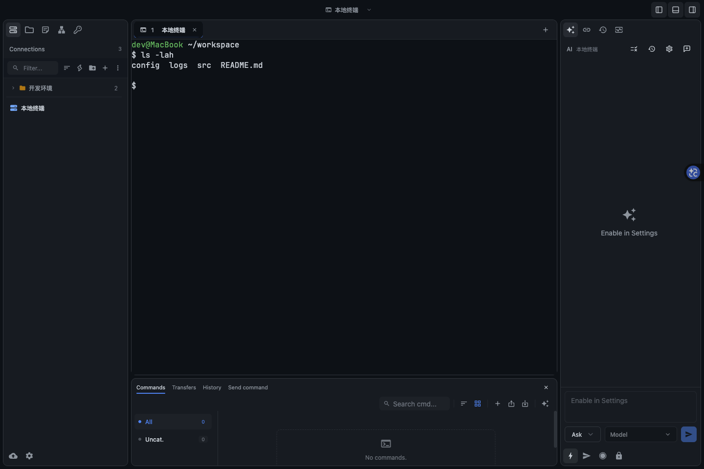
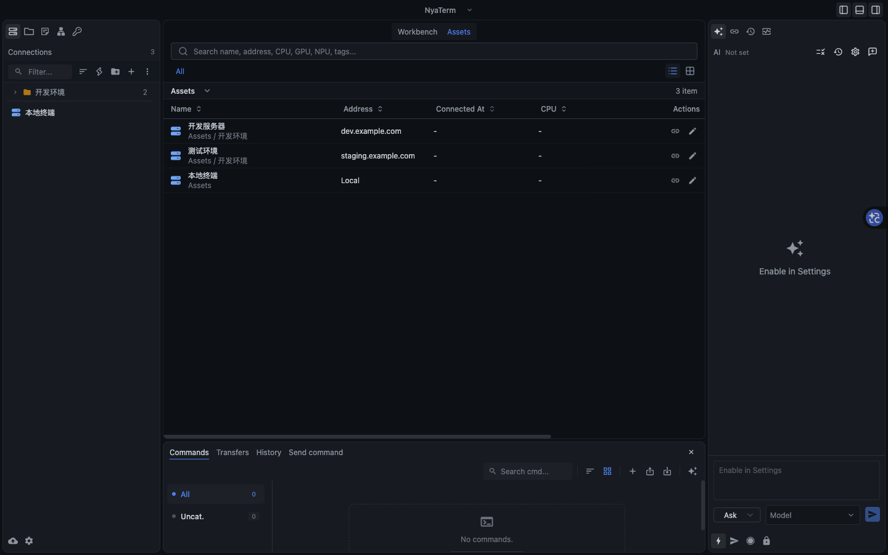
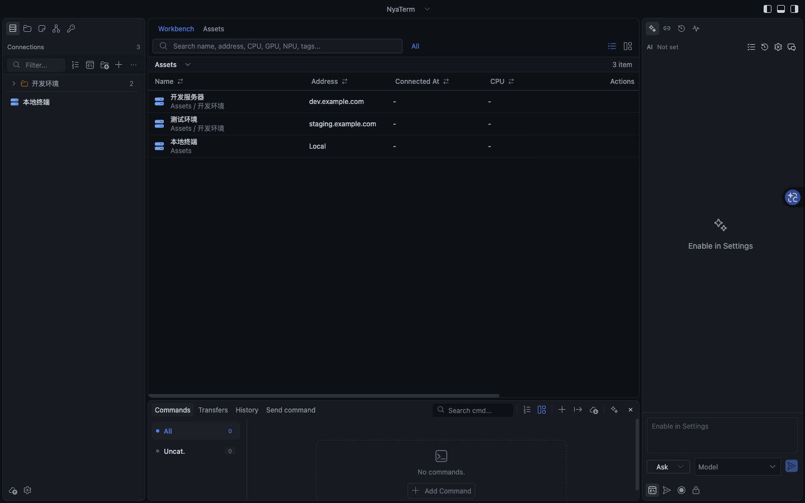
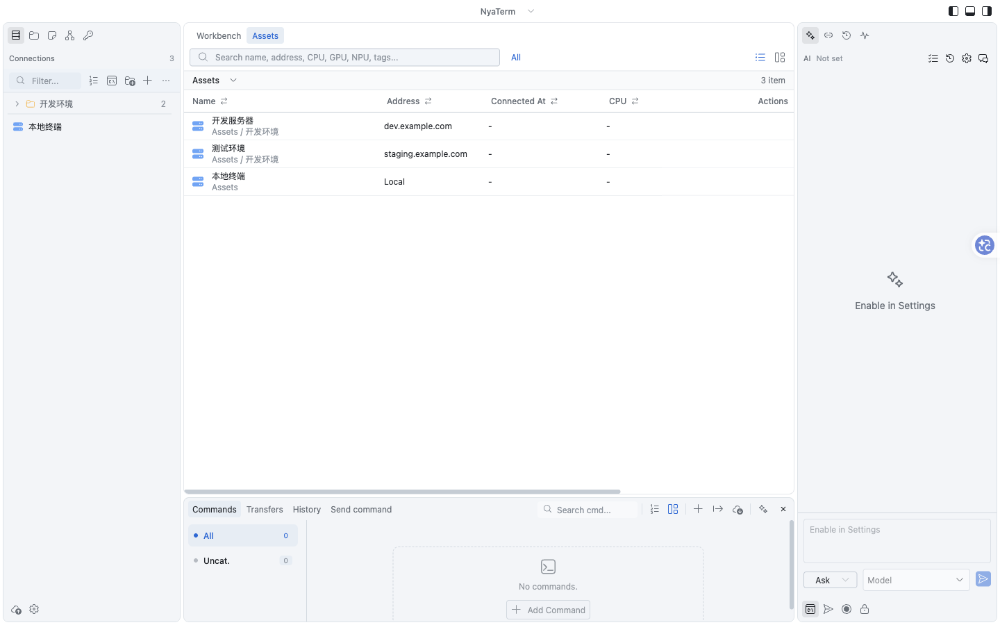
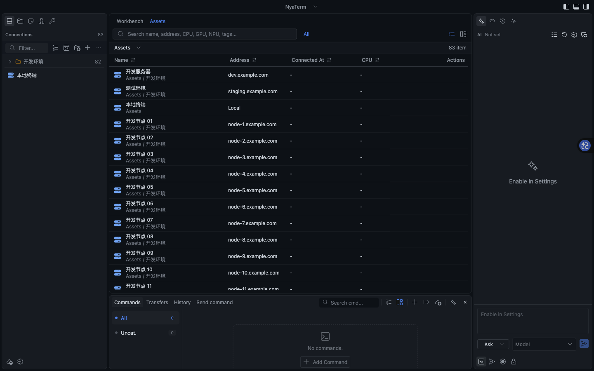
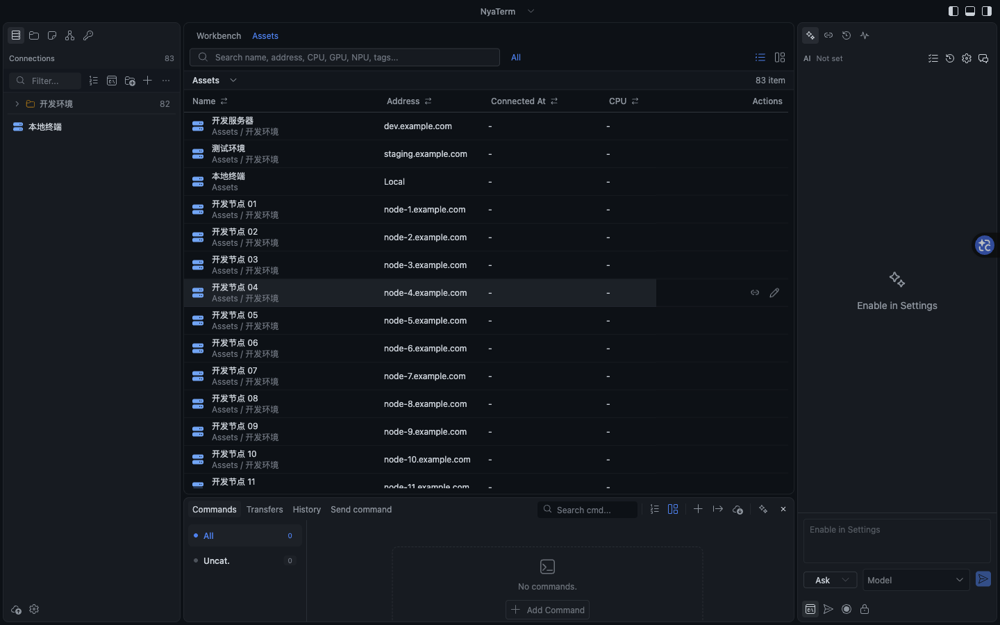

# Rounded workspace UI

The desktop shell uses separate rounded cards for the sidebars, terminal windows,
and bottom tools. This is a layout refactor of the existing React/Tauri client;
SSH, terminal I/O, SFTP, AI execution and persistence services are unchanged.



The screenshot uses the real frontend with sample connection and terminal data.
Native macOS traffic-light controls are provided by Tauri and are absent from
this browser capture.

## Layout and interaction

- The title bar can collapse either sidebar or the bottom tools. Collapsing a
  card retains the mounted content, including command drafts and active sends.
- Sidebar activities appear horizontally above their panel. Bottom actions stay
  below it. The existing ordering, hiding, labels, context menus and drag-to-move
  behavior remain available. A sidebar with no active panel becomes a narrow
  activity rail; floating mode continues to use activity rails and overlays.
- Terminal window splits are individual cards separated by resize gutters.
  Tab dragging, docking, colors, close actions and terminal pane splits use the
  existing session/workspace handlers.
- The bottom card exposes quick commands, transfers, history and command sending.
  It reuses the existing components and command handlers. The transfer queue
  remains accessible from the file explorer too. The tab strip supports arrow,
  Home and End keys.
- Resize handles accept mouse, pen or touch input, and release pointer listeners
  when cancelled, blurred or unmounted. Focused handles support arrow keys (8px)
  and Shift+arrow keys (24px).
- Below 900px the right sidebar becomes an overlay; below 640px the left sidebar
  does too. Title-bar controls and the backdrop open/close the overlays without
  squeezing the terminal to zero width.
- Settings windows use the same card geometry. Panel headings use spacing and
  typography instead of a separate colored strip and heavy separator.

## Compact desktop density



The spacing pass follows the installed VS Code 1.138.0 workbench styles
(`workbench.desktop.main.css`), including its modern editor tabs. The local
VS Code preference places the activity bar at the top. The release version was
also checked against the [official release notes](https://code.visualstudio.com/updates/v1_138).
The initial comparison used local styles and supplied screenshots because native
capture failed. A later pass successfully inspected native VS Code 1.138.0 and
the release NyaTerm window, including their terminal content insets.

- Main and child title bars: 32px, with matching native macOS button placement.
- Session tab strip: 32px; individual tabs: 24px with 4px corners and regular
  12px labels. Active tabs use the theme's hover surface. The default accent
  underline is removed; explicit custom tab colors retain their subtle marker.
- Workspace cards: 8px corners, 4px gutters, and a border mixed to 45% of the
  existing theme border. Increased-contrast preferences restore the full border.
  Resource-monitor sections, metric tiles, charts and disk separators share that
  border token. Separately hosted terminal content is clipped to the card's inner
  bottom radius, keeping its opaque surface from covering the curved border.
- Activity and small toolbar controls: 24px with 16px activity icons. Shared
  buttons, inputs and selects default to 28px, with 24px small variants and
  4px corners. Explicit component size overrides remain supported.
- Connection rows and panel headings use tighter spacing and regular text.
- Asset list rows are 40px instead of 56px; virtualization uses the same height.
  Asset actions and view toggles are borderless, showing a surface on hover or
  keyboard focus. The official custom-tag filters remain unchanged.
- Settings use 12px section padding, 8px field gaps and 16px section gaps;
  dialogs use 16px padding. Controls retain visible keyboard focus indicators.
- Terminal panes have a 10px inset on both sides. The tab strip shares the
  terminal's theme-derived background without a separator line. The existing
  workspace-padding preference adds its original
  8px content inset. Padding belongs to the outer flex layout, so the measured
  xterm host shrinks and the existing resize observer/refit recalculates columns;
  line numbers, timestamps and suggestion overlays keep their shared alignment.

This changes presentation only. Theme palettes, terminal font sizes, saved
connections, tab actions and application behavior are retained.

## VS Code source detail pass

The reference checkout uses VS Code tag `1.138.0`, commit
`7debcd0e2acdea1c52de81bf9ee1620444407dda`. Adapted control rules are in
`src/styles/workbench-controls.css`; the source and icon attribution is recorded
in [THIRD_PARTY_NOTICES.md](../THIRD_PARTY_NOTICES.md).




- Workbench action icons now use Microsoft's Codicons through the existing
  `react-icons/vsc` dependency. Connection/OS and hardware brand icons remain
  available. Geometry follows the source's 16px glyph and 22px action target.
- The bottom card's existing panel actions render in the tab row. There is no
  duplicate title/header inside Commands, Transfers or History. Controls wrap
  when the center becomes narrow; the close button stays in the upper corner.
  Search values remain in their panel state when switching tabs.
- Native buttons provide keyboard activation for session-tab close actions.
  Inactive close buttons and asset row actions appear on hover or keyboard
  focus, while touch inputs keep those actions visible.
- Menu rows, heading text, keycaps, input heights and toolbar baselines follow
  one scale. Asset search/filter/view controls share a row when space permits.
- Checked, hover, focus and disabled states keep their separate meanings; the
  layout toggles no longer have a permanently filled button background.

Validation: all 812 tests in 131 files passed, including shared-toolbar action
routing, search retention and ordinary panel-header fallback. TypeScript passed;
Biome has only the existing `CommandSuggestions.tsx` dependency warning. Browser
checks covered the real frontend with isolated IPC, 1440px and 780px windows,
32px shared bottom header, 40px asset rows, panel switching, keyboard tab closing,
and both built-in GitHub themes. This is not a live SSH/SFTP connection test.

## Auto-hide scrollbars




Native list, file, settings and text-area scrollbars have transparent tracks and
rectangular sliders. Pointer movement within a scrollable pane or scrolling
reveals its slider for 500ms; an idle pointer or retained keyboard focus does
not keep it visible. Moving to another pane, leaving the window or switching
apps clears visibility. Dragging holds visibility until release. Standard
scrollbar colors cover WKWebView, with WebKit pseudo-elements as a fallback.
Native dragging remains browser-owned. Visibility changes do not change the
scrollbar width, avoiding content reflow during interaction.

Radix scroll areas use the same rules, with VS Code's 100ms reveal and 800ms fade
and reduced-motion support. Areas explicitly requesting `type="always"` retain
that behavior. xterm retains its own VS Code-derived visibility controller, and
session-tab strips continue hiding their scrollbars entirely.

All 822 tests in 132 files passed. Coverage verifies idle timing, repeated scroll
events, stationary pointers, independent panes, dragging, leaving the window,
app switches, Radix tracks, horizontal scrolling, xterm/tab exclusions and
cleanup. Earlier browser checks verified idle/hover visibility, scrolling without a
pointer over the area, vertical dragging, horizontal scrolling, stable content
width and Radix reveal/fade using isolated sample data.

## Themes and saved preferences

`src/styles/workspace.css` defines geometry and uses the existing `--df-*` theme
variables for every surface, text color, border and selection. No theme palette,
terminal ANSI palette or theme selection has been replaced. Wallpaper and window
transparency still go through `buildSurfaceCssVariables`.

New installs place connections on the left and AI on the right. Frontend main
and child-window defaults match the Rust defaults. Existing saved activity layouts,
widths and panel selections remain in use; there is no forced migration or new
settings schema. The existing reset-layout action can apply the new activity
placement. Header collapse state and auxiliary bottom-tab selection are local to
an open window; persisted panel sizes and existing quick-command/send visibility
continue using the original settings fields.

## Validation

Run the frontend checks from the repository root:

```sh
pnpm exec tsc --noEmit
pnpm exec vitest run
pnpm lint
pnpm exec vite build
```

Focused regression coverage includes horizontal activity dragging, keyboard and
pointer resizing, cancellation/unmount cleanup, sidebar content retention, bottom
tool switching, draft retention and revealing incoming send-command drafts.

Implementation checks: TypeScript and the production Vite build passed; all
810 tests in 130 files passed. Lint reported no errors and one existing hook
dependency warning in `CommandSuggestions.tsx`. Vite also reports the existing
large-chunk advisory.

The browser UI was also exercised with the real frontend and an isolated Tauri
IPC fixture: terminal rendering, sidebar collapse, transfers, responsive overlays,
and theme-derived surfaces. The fixture is not part of the production entrypoint.
It does not establish SSH/SFTP connectivity or native macOS window behavior.

A native package additionally requires Rust/Cargo and the usual Tauri platform
prerequisites. `pnpm build` builds the Rust MCP sidecar before the frontend;
`pnpm tauri build` builds the complete desktop application.

The macOS arm64 release build passed with Rust/Cargo 1.98.1, including the MCP
sidecar and frontend, using this local-package command:

```sh
pnpm tauri build --ci --bundles app --config '{"bundle":{"createUpdaterArtifacts":false}}'
```

The resulting `src-tauri/target/release/bundle/macos/NyaTerm.app` contains arm64
executables for both the app and MCP sidecar. Its Info.plist passed validation,
and `codesign --verify --deep --strict` passed. The package uses the project's
ad-hoc signing configuration and is not notarized; updater artifacts were disabled
only for this local build. The installed application was not replaced, and this
build check does not establish native runtime or live SSH/SFTP behavior.
